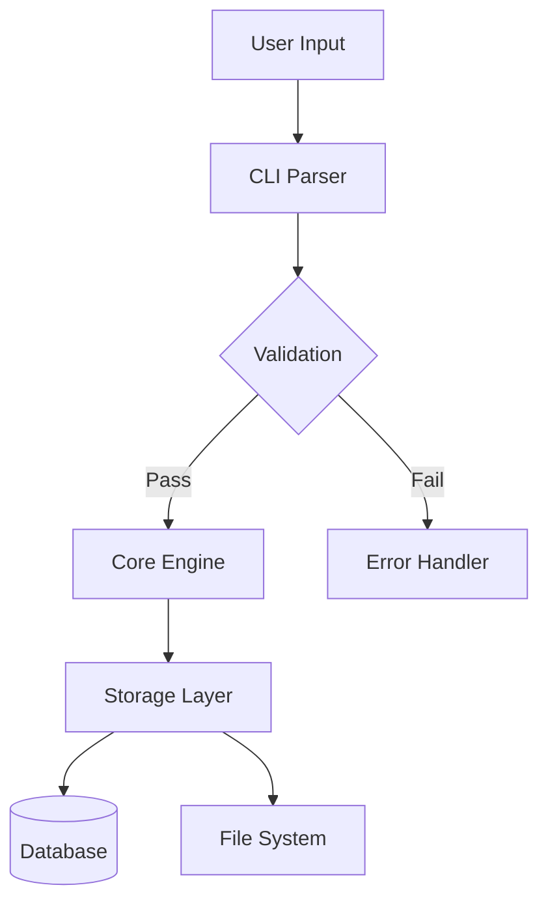

# .map/STRUCTURE.md
> **Vai trò:** Sơ đồ kiến trúc text-based — có thể diff, cập nhật dễ dàng, render ra nhiều format.
> **Input:** Code structure + `.agent/01_STRUCTURE.md`
> **Output:** Architecture representation dạng text (Mermaid/ASCII)
> **Rule:** Text-based để diff được. Không binary/SVG gốc.

---

## Philosophy: Architecture as Code

```
Code thay đổi  →  Map tự động cập nhật  →  Diff giữa version
     ↑                    ↓                      ↓
   Developer       Text-based format        Git trackable
```

**Không dùng:** SVG, PNG, binary diagrams
**Dùng:** Mermaid markdown, ASCII art, YAML tree

---

## Format 1: Mermaid Diagrams

Lưu dưới dạng `.mmd` — có thể render ra SVG/PNG/HTML:



**Ưu điểm:**
- Text-based → diff được
- GitHub/GitLab render native
- Có thể export SVG khi cần
- Dễ sửa bằng text editor

---

## Format 2: YAML Tree (Hierarchical)

Dùng cho component hierarchy + dependencies:

```yaml
# .map/component_tree.yaml
architecture:
  version: "1.0.0"
  last_updated: "2026-03-30"
  
  components:
    core:
      description: "Xử lý logic chính"
      depends_on: []
      exposes: ["process_data", "validate"]
      entry_points: ["main.cpp:core_init"]
      
    cli:
      description: "Command-line interface"
      depends_on: ["core"]
      exposes: ["parse_args", "run_command"]
      entry_points: ["cli/main.cpp"]
      
    storage:
      description: "Read/write operations"
      depends_on: ["core"]
      exposes: ["read", "write", "delete"]
      implementations:
        - filesystem
        - database
        - cloud
        
  data_flow:
    - direction: "cli → core → storage"
      protocol: "internal_api"
      async: false
      
  cross_language_boundaries: []
```

**Ưu điểm:**
- Machine-readable
- Dễ parse để generate docs
- Track dependencies rõ ràng
- Dùng cho consistency check

---

## Format 3: ASCII Call Graph

Dùng cho function-level call relationships:

```
# .map/callgraph_core.txt

core::process_data()
├── core::validate_input()
│   └── utils::sanitize()
├── storage::read()
│   ├── fs::open()
│   └── db::query() [conditional]
└── core::transform()
    ├── core::normalize()
    └── core::encode()
        └── utils::compress()

cli::main()
├── cli::parse_args()
├── cli::validate_args()
└── core::process_data() [main entry]
```

**Ưu điểm:**
- Xem nhanh trong terminal
- Không cần tool
- Dễ grep/search

---

## File Structure

```
.map/
├── STRUCTURE.md              # (file này) Guide + philosophy
├── README.md                 # Overview tổng thể
├── 
├── current/                  # State hiện tại
│   ├── component_tree.yaml
│   ├── data_flow.mmd
│   ├── callgraph_cli.txt
│   ├── callgraph_core.txt
│   └── cross_language.mmd    # Nếu có P/Invoke/IPC
│
├── diff/                     # Lịch sử thay đổi
│   ├── v1.0.0_to_v1.1.0.md   # Diff giữa version
│   ├── 2026-03-30_breaking.md
│   └── TEMPLATE.md         # Format ghi diff
│
└── refs/                     # References cho bug/task
    ├── BUG-2026-0301.json    # Bug linked to nodes
    └── TASK-001.json         # Task linked to components
```

---

## Cập nhật Map (Workflow)

```
[Code thay đổi]
    │
    ▼
[AI phát hiện component/function mới]
    │
    ▼
Cập nhật .map/current/*.yaml / *.mmd / *.txt
    │
    ▼
[So sánh với previous version]
    │── Breaking change? → Ghi vào .map/diff/
    │── New component? → Update component_tree.yaml
    │── New data flow? → Update data_flow.mmd
    ▼
[Update .map/README.md overview]
```

---

## Linking: Bug ↔ Map Node

Khi có bug, liên kết đến map node:

```yaml
# .map/refs/BUG-2026-0301.yaml
bug_id: "BUG-2026-0301"
title: "Memory leak in storage layer"
severity: "high"
affected_nodes:
  component: "storage"
  function: "storage::write()"
  file: "src/storage/write.cpp"
  line_range: "45-89"
  
related_components:
  - "core"          # Core gọi storage
  - "utils"         # Utils được gọi bởi storage
  
arch_impact:
  data_flow_affected: "core → storage"
  contract_violation: false
  
fix_location:
  component: "storage"
  function: "storage::cleanup()"
  
map_snapshot:
  version: "1.0.0"
  commit: "abc123"
```

---

## Linking: Task ↔ Map Component

Task list reference đến map:

```yaml
# .map/refs/TASK-001.yaml
task_id: "TASK-001"
title: "Add encryption to storage layer"
type: "feature"

affected_map_nodes:
  components:
    - name: "storage"
      change_type: "modify"      # modify | add | remove
      new_interfaces: ["encrypt", "decrypt"]
      
  data_flow_changes:
    - from: "core → storage"
      new_step: "encryption before write"
      
  contract_changes:
    internal_api: true             # Có thay đổi không?
    breaking: false              # Có phá vỡ backward compatibility?
    
verification:
  callgraph_updated: true        # Đã cập nhật callgraph chưa?
  component_tree_updated: true
  data_flow_updated: true
```

---

## Diff Format (Giữa version)

```yaml
# .map/diff/v1.0.0_to_v1.1.0.yaml
diff_id: "v1.0.0_to_v1.1.0"
from_version: "1.0.0"
to_version: "1.1.0"
date: "2026-03-30"
triggered_by: "TASK-001"        # Task hoặc PR nào

changes:
  components:
    added:
      - name: "crypto"
        reason: "TASK-001: Thêm encryption"
        
    modified:
      - name: "storage"
        changes:
          - "Thêm dependency: crypto"
          - "Thêm interface: encrypt_write()"
          - "Sửa interface: write() thêm parameter"
        breaking: false
        
    removed: []
    
  data_flow:
    changed:
      - old: "core → storage"
        new: "core → crypto → storage"
        reason: "Encryption layer"
        
  contracts:
    internal_api_changes:
      - function: "storage::write()"
        old_signature: "write(data)"
        new_signature: "write(data, options)"
        breaking: false  # Optional parameter
        
  callgraph_impact:
    new_call_chains:
      - "storage::write() → crypto::encrypt()"
      
    modified_call_chains: []
    
verification:
  all_maps_updated: true
  consistency_check_passed: true
```

---

## Rendering (Xuất ra SVG/PNG)

Khi cần visual đẹp cho presentation:

```bash
# Mermaid CLI
mermaid -i .map/current/data_flow.mmd -o docs/diagrams/data_flow.svg

# Hoặc online: GitHub/GitLab auto-render .mmd files
# Hoặc VSCode extension: Markdown Preview Mermaid Support
```

**Nguyên tắc:** Source of truth là text. SVG là derived output.

---

## Consistency Check (Tự động)

Kiểm tra map có khớp code không:

```yaml
consistency_rules:
  - "Mọi component trong tree phải có thư mục/code tương ứng"
  - "Mọi function trong callgraph phải tồn tại trong code"
  - "Mọi data flow trong mermaid phải có implementation"
  - "Dependencies trong tree phải khớp với #include/import thực tế"
```

**Nếu drift:** Flag trong `STATE.md` + báo user.

---

*Text-based architecture: versionable, diffable, codeable.*
