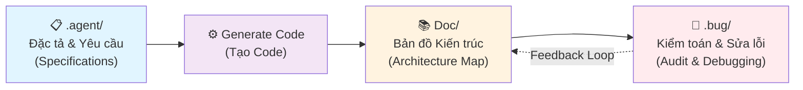

# 🛡️ Zero-Omission AI Framework (ZOA)

<!-- Transform LLMs from unpredictable coders into strict System Auditors -->
> **Biến AI từ những thợ gõ code khó lường thành các Kiểm toán viên Hệ thống kỷ luật**
> 
> *Transform LLMs from unpredictable coders into strict System Auditors.*

<div align="center">

[](http://makeapullrequest.com)
[](https://opensource.org/licenses/MIT)
[](https://github.com)

**[🇻🇳 Tiếng Việt](#-mục-lục) | [🇬🇧 English](#-table-of-contents)**

</div>

---

## 📖 Mục lục
<!-- Table of Contents -->

1. [🌟 Câu chuyện ra đời](#-câu-chuyện-ra-đời)
2. [🚀 Triết lý Cốt lõi](#-triết-lý-cốt-lõi)
3. [⚙️ Luồng Quy trình 3 Bước](#-luồng-quy-trình-3-bước-the-3-phase-pipeline)
4. [🛠️ Hướng dẫn Sử dụng](#-hướng-dẫn-sử-dụng)
5. [🤝 Đóng góp & Mở rộng](#-đóng-góp--mở-rộng)
6. [📝 License](#-license)

---

## 🌟 Câu chuyện ra đời
<!-- Origin Story -->

### 🎯 Bối cảnh Vấn đề
<!-- Problem Context -->

Khi các lập trình viên quen thuộc với hệ sinh thái bậc cao (như C#, React) cần xây dựng các module cấp thấp, can thiệp sâu vào hệ thống (ví dụ: viết native C++ DLL, xử lý đa luồng, can thiệp Windows API), việc nhờ AI viết code 100% là một giải pháp tất yếu.

When developers familiar with high-level ecosystems (such as C#, React) need to build low-level modules, deep system intervention (e.g., writing native C++ DLL, multi-threading handling, Windows API manipulation), relying on AI for 100% code generation becomes an inevitable solution.

### ⚠️ Thách thức
<!-- Challenges -->

Tuy nhiên, với các hệ thống phức tạp, AI cực kỳ dễ bị "ảo giác", bỏ quên logic, hoặc tự ý phá vỡ kiến trúc bảo mật:

However, with complex systems, AI is extremely prone to "hallucinating", forgetting logic, or arbitrarily breaking security architecture:

- 🔴 **Ảo giác logic** | Logic hallucinations
- 🔴 **Bỏ sót hàm quan trọng** | Critical function omissions
- 🔴 **Vi phạm kiến trúc** | Architecture violations
- 🔴 **Lỗi đa luồng không phát hiện** | Undetected multi-threading bugs

### 💡 Giải pháp ZOA
<!-- ZOA Solution -->

**Zero-Omission AI Framework (ZOA)** được sinh ra để giải quyết bài toán đó. Bằng cách thiết lập một luồng làm việc khép kín, chúng ta **ép AI phải tự lập hồ sơ kiến trúc, tự quét vét cạn mã nguồn, và tự ký tên xác nhận** trước khi được phép sửa dù chỉ một dòng code.

**Zero-Omission AI Framework (ZOA)** was created to solve this problem. By establishing a closed workflow loop, we **force AI to self-document architecture, self-audit source code exhaustively, and self-validate** before being allowed to modify even a single line of code.

---

## 🚀 Triết lý Cốt lõi
<!-- Core Philosophies -->

### 1️⃣ 📚 Kiến trúc là Sự thật tối thượng
<!-- Architecture as the Single Source of Truth -->

> Code có thể sai, nhưng tài liệu kiến trúc (được chốt sau khi build) là bất khả xâm phạm.
> 
> Code can be wrong, but architecture documentation (finalized after build) is immutable.

Mọi đánh giá logic của AI phải đối chiếu chéo với tài liệu này.

Every AI logic evaluation must be cross-validated against this documentation.

### 2️⃣ 🎯 Tận diệu (Zero-Omission)
<!-- Zero-Omission Principle -->

> Quét lỗi không phải là hỏi AI "chỗ này có lỗi không?". 
> 
> Bug scanning is not asking AI "is there a bug here?".

Quét lỗi là **ép AI liệt kê 100% các hàm, kiểm tra từng hàm một và đánh dấu checklist**.

Bug scanning is **forcing AI to enumerate 100% functions, check each function individually, and mark checklist**.

### 3️⃣ 📊 Vận hành dựa trên Bằng chứng
<!-- Evidence-based Execution -->

> AI không được tự ý sửa code.
> 
> AI cannot arbitrarily modify code.

AI phải **đưa ra lý thuyết, mô phỏng kịch bản kiểm thử (Test Scenario), và đợi con người phê duyệt** qua "Trạm điều khiển" (Command Hub).

AI must **present theory, simulate test scenarios (Test Scenario), and await human approval** via the "Command Hub".

---

## ⚙️ Luồng Quy trình 3 Bước (The 3-Phase Pipeline)
<!-- The 3-Phase Pipeline -->

Hệ thống ZOA không vận hành dựa trên một file prompt khổng lồ, mà **chia project thành 3 không gian lưu trữ** với các vai trò nối tiếp nhau:

The ZOA system does not operate based on a single monolithic prompt file, but **divides the project into 3 storage spaces** with sequential roles:



---

### 📋 Phase 1: `.agent/` (Đặc tả & Yêu cầu)
<!-- Phase 1: The Blueprint -->

**Mục tiêu | Objective:** Định hình ranh giới và cung cấp nguyên liệu thô trước khi code.

*Goal: Define boundaries and provide raw materials before coding.*

#### 📁 Cấu trúc thư mục | Directory Structure

```
.agent/
├── 📄 architecture.md         # Kiến trúc tổng thể | Overall architecture
├── 📄 conventions.md          # Các quy tắc coding | Coding conventions
├── 📄 task-list.md            # Danh sách task | Task enumeration
├── 📄 api-spec.md             # Đặc tả API | API specification
├── 📄 constraints.md          # Ràng buộc & Giới hạn | Constraints & Limits
└── 📄 forbidden-patterns.md   # Những pattern cấm | Forbidden patterns
```

#### 🎯 Nội dung cần bao gồm | Content Guidelines

- ✅ Cấu trúc thư mục mong muốn | Desired directory structure
- ✅ "Luật thép" về coding convention | "Steel rules" about coding conventions
  - *Ví dụ: Cấm dùng `std::mutex`, chỉ dùng `spin_lock` | Example: Ban `std::mutex`, use only `spin_lock`*
- ✅ Danh sách các Task cần thực hiện | List of tasks to implement
- ✅ Đặc tả API cơ bản | Basic API specification
- ✅ Yêu cầu hiệu năng | Performance requirements
- ✅ Giới hạn tài nguyên | Resource constraints

#### 💬 Cách sử dụng | How to Use

AI dùng dữ liệu trong `.agent/` làm **kim chỉ nam để bắt đầu sinh ra những dòng code đầu tiên**.

AI uses data in `.agent/` as a **compass to start generating the first lines of code**.

```bash
# Bước 1 | Step 1
"Đọc hiểu bản đặc tả trong .agent/ rồi tạo skeleton code"
"Read the specification in .agent/ and create skeleton code"

# Bước 2 | Step 2
"Sinh code đầu tiên dựa trên task-list.md"
"Generate initial code based on task-list.md"
```

---

### 📚 Phase 2: `.doc/` (Bản đồ Kiến trúc)
<!-- Phase 2: The Post-Build Architecture -->

**Mục tiêu | Objective:** Chốt chặn kiến trúc. "Tài liệu hóa" hệ thống thực tế đang chạy.

*Goal: Seal architecture. "Documentize" the actual running system.*

#### 🚨 Tại sao quan trọng? | Why Important?

> Rất nhiều dự án chết vì tài liệu thiết kế không khớp với code thực tế.
> 
> Many projects fail because design documentation doesn't match actual code.

#### 📁 Cấu trúc thư mục | Directory Structure

```
Doc/
├── 📊 00-ARCHITECTURE.md      # Bản đồ kiến trúc chính | Main architecture map
├── 📊 01-DATA-FLOW.md         # Luồng dữ liệu | Data flow diagram
├── 📊 02-MODULE-MAP.md        # Sơ đồ các module | Module relationship map
├── 📊 03-API-REFERENCE.md     # Tham chiếu API thực tế | Actual API reference
├── 📊 04-IPC-PROTOCOL.md      # Giao thức IPC (nếu có) | IPC protocol (if applicable)
├── 📊 05-FUNCTION-INVENTORY.md # Danh mục hàm | Function inventory
└── 📊 06-ERROR-HANDLING.md    # Xử lý lỗi toàn hệ | System-wide error handling
```

#### 🔐 Tính chất quan trọng | Critical Property

**Các tệp trong thư mục `.doc/`** (đặc biệt là bản đồ luồng kiến trúc) **sẽ trở thành Luật Hiến pháp cho Phase 3**.

**Files in `.doc/` folder** (especially architecture flow maps) **become the Constitutional Law for Phase 3**.

```yaml
📋 Constitution Rules:
  ├── Không được phá vỡ luồng dữ liệu | Must not break data flow
  ├── Không được thêm module ngoài dự định | No unplanned modules
  ├── Mọi thay đổi phải được ghi log | All changes must be logged
  └── Mọi hàm mới phải update 05-FUNCTION-INVENTORY | All new functions must update 05-FUNCTION-INVENTORY
```

#### 💬 Cách sử dụng | How to Use

```bash
# Sau khi Phase 1 tạo code xong | After Phase 1 code generation
"Sinh tự động bộ tài liệu trong Doc/ để lập hồ sơ hệ thống thực tế"
"Auto-generate Doc/ documentation to profile the actual system"

# AI sẽ | AI will:
✓ Quét toàn bộ source code
  Scan entire source code
✓ Trích xuất từng hàm, class, interface
  Extract each function, class, interface
✓ Vẽ sơ đồ luồng dữ liệu
  Draw data flow diagrams
✓ Tạo API reference
  Create API reference
```

---

### 🐛 Phase 3: `.bug/` (Kiểm toán & Sửa lỗi)
<!-- Phase 3: The Audit & Zero-Omission -->

**Mục tiêu | Objective:** Kiểm soát vòng đời bảo trì, ép AI làm Kiểm toán viên.

*Goal: Control maintenance lifecycle, force AI to act as Auditor.*

#### 🚀 Quy trình Kiểm toán Nghiêm ngặt | Strict Audit Process

Khi có lỗi xảy ra hoặc cần nâng cấp, **AI không được phép lao vào sửa code ngay**. AI phải vào không gian `.bug/`.

When bugs occur or upgrades are needed, **AI cannot immediately jump to fix code**. AI must enter the `.bug/` space.

#### 📁 Cấu trúc thư mục | Directory Structure

```
.bug/
├── 📋 AUDIT-CHECKLIST.md      # Danh sách kiểm toán | Audit checklist
├── 📋 FUNCTION-SCAN.md        # Quét toàn bộ hàm | Full function scan
├── 🐛 BUG-LOG.md              # Ghi log các lỗi | Bug log
├── 🧪 TEST-SCENARIOS.md       # Kịch bản kiểm thử | Test scenarios
├── 📝 THEORY.md               # Lý thuyết sửa lỗi | Bug fix theory
├── 🔄 AI_INTERFACE.md         # Giao tiếp AI-Human | AI-Human communication
└── ✅ SIGN-OFF.md             # Ký xác nhận | Sign-off document
```

#### 🔄 5 Bước Quy trình Kiểm toán | 5-Step Audit Process

##### Bước 1️⃣ - Đọc Hiến pháp | Step 1 - Read Constitution

```bash
# AI đọc lại Doc/ để lấy chuẩn mực
AI re-reads Doc/ to establish the reference standard
```

**Action:**
- 📖 Đọc `Doc/00-ARCHITECTURE.md` | Read architecture
- 📖 Đọc `Doc/01-DATA-FLOW.md` | Read data flow
- 📖 Đọc `Doc/05-FUNCTION-INVENTORY.md` | Read function inventory

---

##### Bước 2️⃣ - Quét Cạn (Zero-Omission Scan) | Step 2 - Exhaustive Scan

```bash
# Dùng quy tắc "Zero-Omission" quét vét cạn 100% các module
Use "Zero-Omission" rule to exhaustively scan 100% modules
```

**Action:**
- ✅ Liệt kê 100% các hàm hiện tại | Enumerate 100% current functions
- ✅ Kiểm tra từng hàm một | Check each function individually
- ✅ Đánh dấu checklist (`[x]` or `[ ]`) | Mark checklist
- ✅ Ghi lại tất cả điểm sai lệch | Log all discrepancies

**Ví dụ Checklist | Checklist Example:**

```markdown
## 📋 AUDIT-CHECKLIST.md

### Module: NetworkManager
- [x] Init() - Kiểm tra xong | Checked
- [x] Connect() - Có memory leak | Has memory leak ⚠️
- [ ] Disconnect() - Chưa kiểm tra | Not checked yet
- [x] SendData() - OK
- [x] ReceiveData() - Race condition | Race condition detected 🔴

### Status: 4/5 checked | 2 issues found
```

---

##### Bước 3️⃣ - Ghi Log Lỗi | Step 3 - Log Bugs

```bash
# Ghi log các điểm sai lệch logic vào hệ thống theo dõi Bug
Log logic deviations into Bug tracking system
```

**Format BUG-LOG:**

```markdown
## 🐛 BUG-LOG.md

### Bug #001 - Memory Leak in NetworkManager::Connect()
**Severity:** 🔴 CRITICAL
**Location:** src/network/NetworkManager.cpp:145
**Description:** 
  Việc gọi malloc() không được free() trong đường dẫn lỗi
  malloc() call not freed in error path
**Root Cause:**
  Thiếu error handling logic
  Missing error handling logic
**Evidence:**
  - Dòng 145-150 không có corresponding free()
  - Lines 145-150 have no corresponding free()
  
### Bug #002 - Race Condition in ReceiveData()
**Severity:** 🟠 HIGH
**Location:** src/network/NetworkManager.cpp:200
**Description:**
  Truy cập buffer mà không có lock
  Buffer access without lock
```

---

##### Bước 4️⃣ - Trình bày Lý thuyết & Kịch bản Tự kiểm thử | Step 4 - Present Theory & Self-test Scenario

```bash
# Trình bày lý thuyết sửa lỗi và kịch bản tự kiểm thử
Present fix theory and self-test scenario
```

**Format THEORY.md:**

```markdown
## 📝 THEORY.md

### Fix for Bug #001 - Memory Leak in Connect()

#### 🧠 Lý thuyết sửa lỗi | Fix Theory
```cpp
// OLD CODE (Sai) | Wrong
void Connect() {
    char* buffer = malloc(1024);
    if (sendPacket(buffer) == ERROR) {
        return;  // 🔴 Leak! Never freed
    }
    free(buffer);
}

// NEW CODE (Đúng) | Correct
void Connect() {
    char* buffer = malloc(1024);
    if (sendPacket(buffer) == ERROR) {
        free(buffer);  // ✅ Fixed
        return;
    }
    free(buffer);
}
```

#### 🧪 Kịch bản Tự kiểm thử | Self-test Scenario

**Test Case #1.1 - Normal Path**
```
Input:  Connect() with valid packet
Expected: Buffer allocated → sent → freed
Verify: valgrind reports 0 leaks ✅
```

**Test Case #1.2 - Error Path**
```
Input:  Connect() with invalid packet (sendPacket returns ERROR)
Expected: Buffer allocated → error detected → freed before return
Verify: valgrind reports 0 leaks ✅
```

---

##### Bước 5️⃣ - Chờ Phê duyệt từ Con người | Step 5 - Await Human Approval

```bash
# Chỉ thực thi khi có sự đồng ý của con người qua tệp Giao tiếp
Execute only with human approval via Communication file
```

**Format AI_INTERFACE.md:**

```markdown
## 🔄 AI_INTERFACE.md - Command Hub (Trạm Điều khiển)

### 📤 From AI to Human (AI gửi đến Con người)

**Report:** Ready for Phase 3 Execution
```
- ✅ Scanned: 45/45 functions
- 🐛 Bugs found: 3
- 📝 Fixes proposed: 3
- 🧪 Test scenarios: 9
```
**Status:** WAITING FOR APPROVAL ⏳

---

### 📥 From Human to AI (Con người gửi đến AI)

**Approval:** APPROVED ✅
```
You may proceed with:
✓ Bug #001 fix
✓ Bug #002 fix
✗ Bug #003 requires discussion (needs more info)
```

**Instructions:**
1. Apply fixes for Bug #001 and #002
2. Create PR #456
3. Add test coverage for Test Case #1.1 and #1.2
```

---

#### 🎯 Toàn bộ Quy trình Visual | Full Process Visual

```
┌─────────────────────────────────────────────────────────┐
│ Phase 3 Execution Flow                                  │
└─────────────────────────────────────────────────────────┘

   AI              HUMAN
   │                │
   ├──→ Read Doc/   │
   │                │
   ├──→ Scan Code   │
   │    (100%)      │
   │                │
   ├──→ Log Bugs    │
   │                │
   ├──→ Write THEORY├──→ 👤 Review
   │    & TESTS     │     THEORY.md
   │                │     TEST-SCENARIOS
   ├──→ AI_INTERFACE├────→ Decision
   │    "AWAITING    │     "APPROVED"
   │     APPROVAL"   │
   │    ⏳            │
   │                │
   │    ←───────────┤
   │                │
   ├──→ Apply Fix   │
   │    (approved)  │
   │                │
   ├──→ SIGN-OFF.md │
   │    (confirm)   │
   │                │
   └──→ Merge to    │
       Main Code    │
```

---

## 🛠️ Hướng dẫn Sử dụng
<!-- Getting Started Guide -->

### 📥 Cài đặt | Installation

#### Bước 1️⃣ - Copy Templates
```bash
# Clone hoặc copy repository
git clone https://github.com/j2-cuong/Zero-Omission-Harness.git
cd Zero-Omission-Harness

# Copy templates vào dự án của bạn
cp -r templates/.agent-template      ~/your-project/.agent
cp -r templates/doc-template         ~/your-project/Doc
cp -r templates/.bug-template        ~/your-project/.bug
```

#### Bước 2️⃣ - Tùy chỉnh cho Stack của bạn
```bash
cd ~/your-project

# Chỉnh sửa .agent/ cho Stack công nghệ của bạn
# Edit .agent/ for your technology stack
vi .agent/conventions.md
vi .agent/task-list.md
vi .agent/api-spec.md
```

### 🎯 Sử dụng với AI Assistant (Cursor/Claude/Copilot)
<!-- Using with AI Assistants -->

#### 📋 Prompt Bắt đầu Phase 1 | Phase 1 Startup Prompt

```
Đọc hiểu luồng làm việc của ZOA Framework.

Bắt đầu từ Phase 1:
1. Đọc toàn bộ file trong .agent/
2. Hiểu rõ kiến trúc, conventions, constraints
3. Tạo skeleton code dựa trên task-list.md
4. Tuân thủ 100% các forbidden-patterns.md

Hãy bắt đầu bằng cách:
- Liệt kê tất cả file cần tạo
- Tạo struct/class definitions
- Tạo function signatures (không implementation)

---

Read the ZOA Framework workflow.

Start from Phase 1:
1. Read all files in .agent/
2. Understand architecture, conventions, constraints thoroughly
3. Create skeleton code based on task-list.md
4. Comply with 100% of forbidden-patterns.md

Begin by:
- Enumerate all files to create
- Create struct/class definitions
- Create function signatures (no implementation)
```

#### 📚 Prompt Bắt đầu Phase 2 | Phase 2 Startup Prompt

```
Phase 2 - Documentation Generation:

1. Quét toàn bộ source code hiện tại
   Scan entire current source code
2. Trích xuất:
   Extract:
   - Tất cả functions, classes, interfaces
     All functions, classes, interfaces
   - Data flow relationships
   - Module dependencies
   - Error handling patterns

3. Tạo documentation trong Doc/:
   Create documentation in Doc/:
   - 00-ARCHITECTURE.md (overall structure)
   - 01-DATA-FLOW.md (with ASCII diagrams)
   - 02-MODULE-MAP.md (dependency graph)
   - 03-API-REFERENCE.md (function signatures)
   - 05-FUNCTION-INVENTORY.md (checklist format)

Yêu cầu: Tài liệu PHẢI chính xác 100% so với code thực tế
Requirement: Documentation MUST be 100% accurate vs actual code
```

#### 🐛 Prompt Bắt đầu Phase 3 | Phase 3 Startup Prompt

```
Phase 3 - Audit & Bug Detection:

Một bug đã được phát hiện: [DESCRIBE BUG]

Hãy thực hiện:
1. Đọc Doc/ để lấy chuẩn mực
2. Quét 100% functions (dùng Zero-Omission checklist)
3. Ghi log tất cả bugs vào BUG-LOG.md
4. Với mỗi bug:
   - Viết THEORY (fix explanation)
   - Tạo TEST-SCENARIOS (test cases)
   - Gửi AI_INTERFACE.md (awaiting approval)
5. ĐỪNG sửa code cho đến khi con người approve

---

Phase 3 - Audit & Bug Detection:

A bug has been detected: [DESCRIBE BUG]

Please execute:
1. Read Doc/ to establish baseline
2. Scan 100% functions (use Zero-Omission checklist)
3. Log all bugs in BUG-LOG.md
4. For each bug:
   - Write THEORY (fix explanation)
   - Create TEST-SCENARIOS (test cases)
   - Send AI_INTERFACE.md (awaiting approval)
5. DON'T modify code until human approves
```

---

### 📊 Ví dụ Hoàn chỉnh | Full Example

Xem thư mục `examples/` để có ví dụ dự án hoàn chỉnh sử dụng ZOA:

See the `examples/` folder for complete project examples using ZOA:

```
examples/
├── cpp-multithreading/       # C++ đa luồng | C++ multi-threading
│   ├── .agent/
│   ├── Doc/
│   └── .bug/
├── golang-microservice/       # Go microservice
│   ├── .agent/
│   ├── Doc/
│   └── .bug/
└── rust-embedded/            # Rust embedded
    ├── .agent/
    ├── Doc/
    └── .bug/
```

---

## 🤝 Đóng góp & Mở rộng
<!-- Contributing & Extensions -->

ZOA hiện tại là một **"Hệ tư tưởng quản lý AI"** (Framework as a Philosophy). Để biến nó thành một công cụ tự động hóa hoàn chỉnh, chúng tôi đang tìm kiếm sự đóng góp từ cộng đồng:

ZOA is currently a **"Framework as a Philosophy"**. To transform it into a complete automation tool, we seek community contributions:

### 🎯 Các hướng đóng góp chính | Main Contribution Paths

#### 1. 🧠 ZOA IDE Skills
<!-- IDE Skill Creation -->

Tạo "Skill" cho IDE: Chuyển đổi các quy tắc trong `.agent/`, `Doc/`, `.bug/` thành định dạng `.mdc` cho Cursor hoặc `.cursorrules` cho GitHub Copilot.

Create IDE "Skills": Convert rules in `.agent/`, `Doc/`, `.bug/` into `.mdc` format for Cursor or `.cursorrules` for GitHub Copilot.

```bash
# Ví dụ | Example
.agent/.cursorrules                # Cursor rules from Phase 1
.agent/.mdc                        # Markdown config for Claude
```

#### 2. 🛠️ ZOA CLI Tool
<!-- CLI Tool Development -->

Phát triển `zoa-cli`: Xây dựng tool trích xuất Abstract Syntax Tree (AST) từ mã nguồn để tự động tạo danh sách hàm cho AI kiểm toán.

Develop `zoa-cli`: Build tool to extract Abstract Syntax Tree (AST) for auto-generating function lists for AI audit.

```bash
# Ví dụ sử dụng | Usage example
zoa-cli scan --language cpp --output .bug/FUNCTION-SCAN.md src/

# Output: Auto-generated FUNCTION-SCAN.md with 100% function inventory
```

**Công nghệ cần | Required Technologies:**
- AST parsing (tree-sitter, clang)
- Code generation
- Multi-language support

#### 3. 📖 Luật Coding (Language Rules)
<!-- Language-Specific Rules -->

Đóng góp các **"luật thép"** thực chiến cho các ngôn ngữ khác:

Contribute **"Steel Rules"** for other languages:

```
Hiện có | Currently have:
- C++, C#, JavaScript

Cần thêm | Need to add:
- 🦀 Rust (memory safety rules)
- 🐹 Go (concurrency patterns)
- 🐍 Python (threading/async)
- ⚡ TypeScript (advanced patterns)
- 🔗 Blockchain (smart contract specific)
- ...
```

**Format chuẩn | Standard Format:**
```markdown
# Language: Rust

## Memory Safety Rules
- [ ] All unsafe blocks must be documented
- [ ] No manual memory management
- [... more rules ...]
```

### 🌟 Cách Đóng góp | How to Contribute

#### 📝 Bước 1 - Fork & Clone
```bash
git clone https://github.com/j2-cuong/Zero-Omission-Harness.git
cd Zero-Omission-Harness
git checkout -b feature/your-contribution
```

#### 🔧 Bước 2 - Tạo các thay đổi
```bash
# Ví dụ: Thêm language rule cho Rust
mkdir -p templates/.agent-template/language-rules/rust
echo "# Rust Rules" > templates/.agent-template/language-rules/rust/rules.md
```

#### ✅ Bước 3 - Test & Document
```bash
# Thêm test case (nếu có)
# Add test case (if applicable)
# Viết documentation
# Write documentation
```

#### 🚀 Bước 4 - Submit PR
```bash
git add .
git commit -m "feat: add Rust language rules for ZOA"
git push origin feature/your-contribution

# Mở Pull Request trên GitHub
# Open Pull Request on GitHub
```

### 💬 Liên hệ & Thảo luận | Contact & Discussion

- 🐛 **Issues:** [GitHub Issues](https://github.com/j2-cuong/Zero-Omission-Harness/issues)
- 📧 **Email:** [j2.cuong@gmail.com]

---

## 📊 Comparison: Before & After ZOA

### ❌ Trước ZOA (Chaos)
<!-- Before ZOA -->

```
Lập trình viên → AI → Code ❌ → "Bạn tự debug đi" → Chaos 🔥
Developer → AI → Code ❌ → "You debug yourself" → Chaos 🔥
```

**Vấn đề:**
- AI viết tùy tiện | AI codes arbitrarily
- Không có kiến trúc | No architecture
- Lỗi mà không biết | Unknown bugs
- Tư bỏ qua hàm | Missing functions

### ✅ Sau ZOA (Controlled)
<!-- After ZOA -->

```
Lập trình viên → [Phase 1: Spec] → [Phase 2: Doc] → [Phase 3: Audit] → Clean Code ✅
Developer → [Phase 1: Spec] → [Phase 2: Doc] → [Phase 3: Audit] → Clean Code ✅
```

**Lợi ích:**
- ✅ Kiến trúc rõ ràng | Clear architecture
- ✅ 100% function inventory | Complete inventory
- ✅ Traced bug fixes | Traceable fixes
- ✅ Human-approved changes | Human oversight

---
---

## 📝 License
<!-- License -->

MIT License - Tự do sử dụng, sửa đổi, và phân phối.

MIT License - Free to use, modify, and distribute.

```
Copyright (c) 2025 Zero-Omission-Harness AI Framework

Permission is hereby granted, free of charge, to any person obtaining a copy
of this software and associated documentation files (the "Software"), to deal
in the Software without restriction...
```
---

## 🙏 Cảm ơn | Acknowledgments

Cảm ơn tất cả những ai đã đóng góp ý tưởng, code, và feedback cho ZOA:

Thanks to everyone who contributed ideas, code, and feedback to ZOA:

- 🌟 Community Contributors
- 🤝 Beta Testers
- 💭 Ideators & Philosophers

---

## 🎯 Roadmap

- [ ] v0.2: ZOA CLI Tool
- [ ] v0.3: IDE Extensions (Cursor, Copilot)
- [ ] v0.4: Language-specific Rule Packs
- [ ] v0.5: Web Dashboard for Bug Tracking
- [ ] v1.0: Full Automation Suite

---

<div align="center">

**Made with ❤️ for developers who care about code quality**

*Được tạo với ❤️ cho các lập trình viên quan tâm đến chất lượng code*

[](https://github.com)
[](https://twitter.com)

</div>
